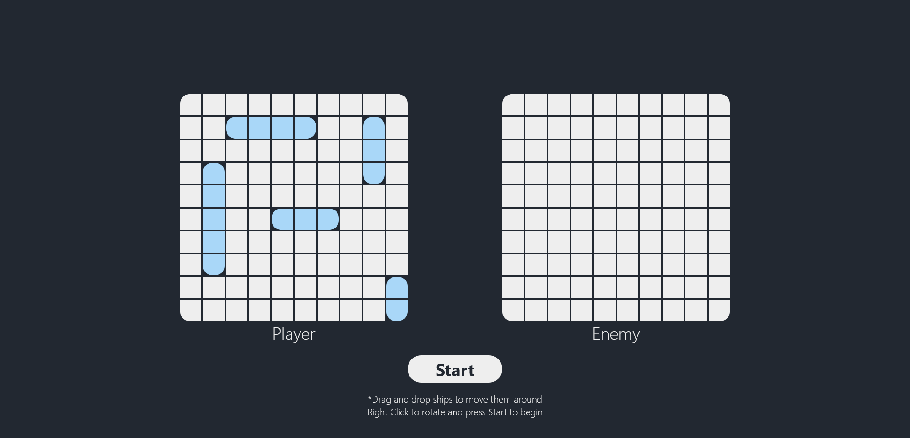
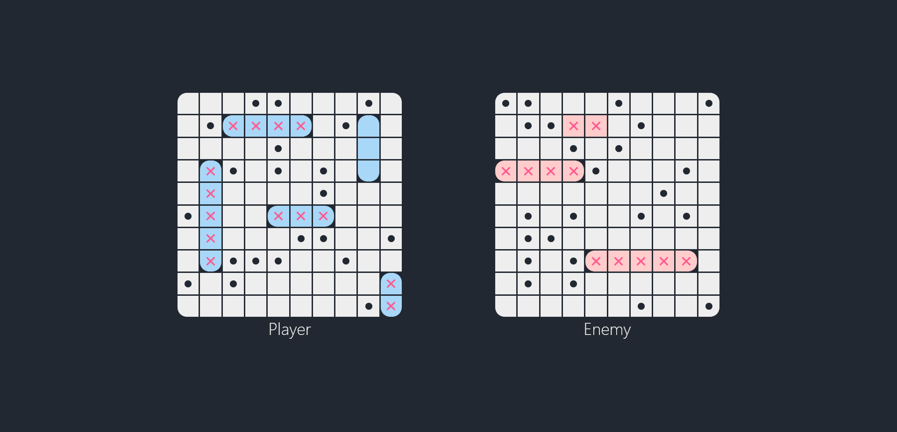

# Odin Battleship

A Battleship game against an intelligent AI algorithm. Made using TDD (Test Driven Development) for an assignment in [The Odin Project](https://www.theodinproject.com/lessons/node-path-javascript-battleship). Tests were written with [Jest](https://jestjs.io/).

## Enemy AI Algorithm

I have tried my best to make the enemy act like a human would:
- It places ships randomly on the board;
- Once the round starts, it begins attacking cells randomly until it hits your ship;
- Once it hits your ship, it starts attacking adjacent cells until it hits again;
- After hitting the second cell of your ship, it remembers the axis of the ship and keeps attacking only in that direction until your ship is sunk.

The behavior is different when several ships are positioned right next to each other. When all ship cells are hit in an axis but no ship is sunk, then it starts attacking cells adjacent to the already hit ship cells, but in the opposite axis. It is difficult to explain in text, but during gameplay the logic of the AI becomes clear. So I recommend you try it yourselves [here](https://lukatsanavabtu.github.io/odin-battleship/).

## UI

First, you have to position your ships. All the available ships are already placed on your grid, you can move them around by dragging and dropping. There will be indicators that will tell you if your new ship placement is valid. You can rotate your ships by right-clicking them. 
Once the round begins, clicking the enemy cells will fire a shot at them and the enemy will instantly fire back. Once you have sunk a ship, its shape will be revealed and a message will appear informing you about the name and length of the ship you have just sunk. If you lose the match, all enemy ships will be reavealed, so you can see what you missed.

## Test Driven Development

A lot of the functions in this project were made using TDD. Before I began writing the function itself, first I wrote unit tests for it using Jest. This may seem to be much slower than not making tests at all, but in reality, it sped up the coding process substantially. Here are some reasons why this was the case:
- Less bugs slip by, resulting in less time spent debugging;
- TDD naturally leads to nicer code by encouraging smaller, more focused functions that are easier to test;
- Easier refractoring, you don't have to manually check for problems after each change;
- Even though I was working on this project alone, in general, comprehensive test coverage serves as living documentation, making it easier for teams to understand system functionality and component behaviors;
- The process is very fun and satisfying. The tests going green is almost like a reward in a video game.

## Screenshots

